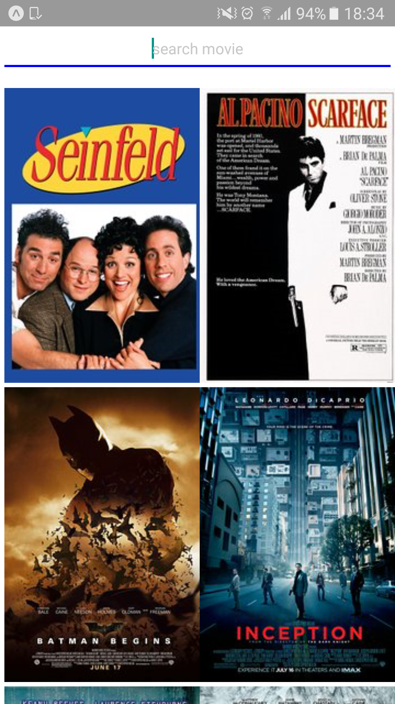

# Movie Searcher (Mobile App)

Educational, simple project for searching movies from local files inside repo (/app/img/).

#### Using:  
- React Native
- JavaScript ES6

#### How this app created?
    npm install -g create-react-native-app  // if not installed
    create-react-native-app movie-searcher
    cd movie-searcher
    npm start    

#### Screenshot of app:  
<h1>
    
</h1>
     
#### Todos
  - rename ImageElement to MovieElement
  - imageWrapper paddings not working
    
    
#### Note/References:  
- This project is slightly modified, refactored and ES6 version of https://www.youtube.com/watch?v=6fqwWwHwC6U.

This project was bootstrapped with [Create React Native App](https://github.com/react-community/create-react-native-app).

